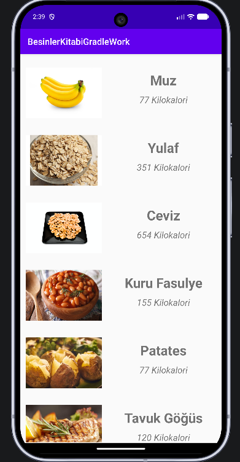
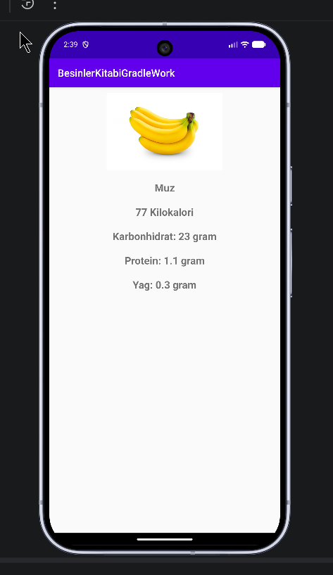

# BesinlerKitabiGradleWork

Bu repo, Atil Samancioglu egitimi dogrultusunda gelistirilmis bir **Kotlin ogrenme projesidir**.  
Amac; Android tarafinda modern temel taslari (MVVM, Room, Retrofit, Navigation, RecyclerView, LiveData) birlikte kullanarak **gercek bir mini uygulama akisini** bastan sona ogrenmektir.

Uygulama, besin verilerini internetten alir, yerelde saklar ve liste/detay ekranlarinda gosterir.

## Bu Proje Neden Onemli?

Bu proje "sadece ekran gosteren" bir ornek degildir; Android'de sik kullanilan kavramlari tek uygulama icinde birlestirir:

- API'den veri cekme
- Veriyi Room ile cacheleme
- UI state'ini ViewModel + LiveData ile yonetme
- Fragmentler arasi guvenli arguman gecisi (Safe Args)
- RecyclerView ile performansli listeleme
- Glide ile agdan gorsel yukleme

Kisacasi bu repo, Android'de orta seviyeye geciste referans alinabilecek bir ogrenme dosyasi gibi dusunulebilir.

## Ekran Goruntuleri

### Besin Listesi



### Besin Detay



## Uygulama Ozellikleri

- Besin listesini uzak JSON kaynagindan alir.
- Cekilen veriyi Room veritabanina kaydeder.
- Liste ekraninda besin adi + kalori + gorsel gosterir.
- Liste elemanina tiklaninca detay ekranina gecer.
- Detay ekraninda secilen besinin tum makro degerlerini gosterir.
- Swipe-to-refresh ile manuel guncelleme yapar.

## Kullanilan Teknolojiler

- **Dil:** Kotlin
- **Mimari:** MVVM
- **UI Katmani:** Fragment, RecyclerView, ViewBinding, DataBinding
- **State Yonetimi:** LiveData, ViewModel
- **Ag Katmani:** Retrofit, Gson Converter
- **Asenkron:** RxJava2 + Coroutines
- **Lokal Veri:** Room
- **Navigasyon:** Navigation Component + Safe Args
- **Gorsel Yukleme:** Glide
- **Build:** AGP 8.2.2, Gradle 8.5, Kotlin 1.9.22
- **JVM Target:** Java 17

## Mimariyi Uzun Uzun Anlatim

### 1) `model` katmani

`Food` sinifi hem JSON parse etmek hem de Room entity olarak kullanilmak uzere tasarlanmistir.

- `@SerializedName` ile API'den gelen alanlar map edilir.
- `@Entity` ve `@PrimaryKey(autoGenerate = true)` ile Room tablo yapisi olusur.
- Ayni modelin hem agdan gelen veri hem lokal kayit icin kullanilmasi ogrenme asamasinda anlasilirlik saglar.

### 2) `service` katmani

Bu katman iki ana gorev yapar:

1. **Uzak veri erisimi (Retrofit)**
   - `FoodApi`: endpoint tanimi
   - `FoodApiService`: Retrofit instance olusturma ve API cagrisi
2. **Lokal veri erisimi (Room)**
   - `FoodDAO`: ekle, listele, tek kayit getir, sil
   - `FoodDatabase`: singleton Room database kurulumu

Boylece veri kaynagi soyutlanir; UI tarafi "veri nereden geldi" detayina daha az bagimli olur.

### 3) `viewModel` katmani

ViewModel siniflari UI state'ini tasir ve ekranlara gerekli datayi hazirlar:

- `FoodListViewModel`
  - Agdan veri ceker
  - Room'a kaydeder
  - `foodList`, `foodErrorMessage`, `foodIsLoading` LiveData'larini gunceller
- `FoodDetailViewModel`
  - Secilen `uuid` ile Room'dan tek kaydi getirir
  - `foodLiveData` ile detay ekranina aktarir
- `BaseViewModel`
  - CoroutineScope yonetimi ve lifecycle temizligi icin temel siniftir

Bu yapi sayesinde Fragment'lar sadece UI isine odaklanir, veri/logic ViewModel'de kalir.

### 4) `view` katmani

- `BesinListesiFragment`
  - RecyclerView kurar
  - SwipeRefresh olayini dinler
  - LiveData observer'lari ile loading/error/list state gosterimini yapar
- `BesinDetayiFragment`
  - Safe Args ile gelen `besinId` degerini alir
  - ViewModel'e sorup Room'dan detayi ceker
  - Text ve gorseli ekrana bind eder
- `MainActivity`
  - NavHost container gorevi gorur

### 5) `adapter` katmani

`FoodRecyclerAdapter` liste satirlarini cizer:

- ViewBinding ile row elemanlarini doldurur
- Glide extension fonksiyonuyla gorsel yukler
- Satira tiklandiginda `BesinListesiFragmentDirections` ile detay ekranina guvenli navigation yapar

### 6) `util` katmani

- `downloadImage` ve `makePlaceHolder`: Glide islemlerini sade tutar
- `PrivateSharedPreferences`: zaman bilgisini saklayarak cache kontrolu altyapisina zemin hazirlar

## Uctan Uca Veri Akisi

1. Kullanici liste ekranina gelir.
2. `refreshData()` tetiklenir.
3. Retrofit ile JSON cekilir.
4. Sonuc Room'a yazilir (`deleteAllFood` + `insertAll`).
5. Eklenen satirlarin `uuid` degerleri modele islenir.
6. `foodList` LiveData update olur.
7. RecyclerView yeni listeyi cizer.
8. Kullanici bir item'a tiklar.
9. `uuid` Safe Args ile detay fragmentina gider.
10. Room'dan tek kayit okunur ve detay ekrani guncellenir.

## Proje Dizini

```text
BTKAdvacedKotlinCourse/
├─ app/
│  ├─ src/main/java/com/atilsamancioglu/besinlerkitabigradlework/
│  │  ├─ adapter/
│  │  ├─ model/
│  │  ├─ service/
│  │  ├─ util/
│  │  ├─ view/
│  │  └─ viewModel/
│  └─ src/main/res/
├─ docs/images/
│  ├─ list-screen.png
│  └─ detail-screen.png
└─ README.md
```

## Kurulum ve Calistirma

### Gereksinimler

- Android Studio (guncel surum)
- JDK 17 veya uzeri
- Android SDK (compileSdk 34)

### Kurulum

```bash
git clone https://github.com/HalilMertDeveli/BTKAdvacedKotlinCourse.git
```

Sonrasinda Android Studio ile acip Gradle sync tamamlandiginda calistirabilirsiniz.

### Build Komutlari

Linux/macOS:

```bash
./gradlew build
```

Windows:

```powershell
.\gradlew.bat build
```

## Dogrulama Durumu

Bu projede derleme testi yapildi ve uygulama **basariyla build oldu**.  
README icindeki ekran goruntuleri uygulamanin calisan halinden alinmistir.

## Ogrenme Projesi Olarak Neler Ogrenilir?

Bu repo ile su basliklar pratik edilir:

- MVVM ile katmanli dusunme
- UI state yonetimi (loading/error/success)
- API + lokal DB birlikte kullanimi
- Navigation graph mantigi
- Fragment lifecycle ve binding kullanimi
- Asenkron islemlerde thread yonetimi

Egitim bitiminde bu proje, daha buyuk uygulamalara gecmeden once guclu bir temel olusturur.

## Ilerletme Onerileri

- RxJava veya Coroutines'ten birini secip tek yaklasima gecmek
- Repository katmani ekleyip test edilebilirligi artirmak
- `CompositeDisposable` temizligini `onCleared` icinde netlestirmek
- String kaynaklarini tamamen `strings.xml` uzerine tasimak
- Hata durumlari icin kullaniciya daha zengin mesajlar gostermek

## Kaynak Repo

Projenin GitHub adresi:  
[HalilMertDeveli/BTKAdvacedKotlinCourse](https://github.com/HalilMertDeveli/BTKAdvacedKotlinCourse.git)
